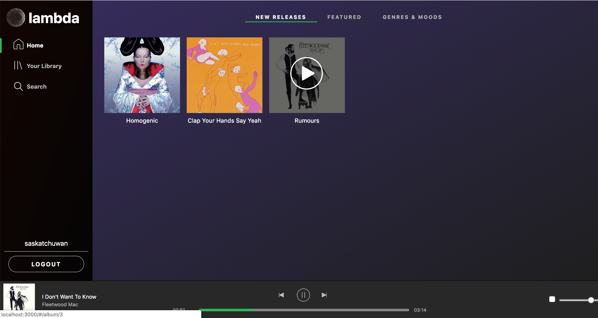

# Lambda

* [Live Demo](https://lambda-music.herokuapp.com/#/)

Lambda is a Spotify-cloned music web app that allows users to explore music in the browse section, curate playlists within their library, search for artists, albums and playlists and listen to their favorite music while they explore!


## Technologies

Lambda utilizes **Rails / PostgresQL** for the backend with **React / Reux** on the frontend. **Amazon S3** was used to store media files. **ActiveStorage** was used to upload these files to cloud storage and allowed us to attach references to these files for existing application modals through polymorphic associations. This project was designed and built over the course of 10 days and I plan on rolling out with more features over time.


## Features
---
1. Full frontend & backend user authentication
2. Users are able to create/delete playlists, add/remove songs to playlist and playlists will automatically be saved to their **Library**
3. Users are able to explore songs, albums and playlists in **Browse**
4. Users are able to continously play music in the play bar while they browse. Users are able to click on album / playlist tiles to queue up the play bar - play bar will proceed to play the next song in the queue when the previous song ends. Users are able to pause/play, toggle volume and toggle to previous/next song in the play bar.
5. Users are able to **Search** for to find new artists, albums and playlists.


### Continuous play with song queue and previous / next song toggle functionality
When playing a song from an album or a playlist, the play bar will have access to a song queue that allows it to move on to the next song automatically at the end of each song. This song queue data is also used in the logic to allow users to click on the previous / next toggles to go back one song or skip to a next song in the queue.




This was accomplished by setting up a key (songIdQueue) in a unique slice of state (playBar) to host the list of song ids. This approach was ideal as it ensured that we would not override existing state data if the user chose to navigate to different pages while continuously listening to music and it kept our redux state normalized as we only needed to store the song ID's necessary for a fetchSong() call. Within the same playBar slice of state, one other key (currSong) was responsible for hosting the song data need to render the song in the music player and display associated artist/album data in our play bar.


Frontend slice of state for playBar:
```
playBar: {
  currSong: {
    album: {
      coverUrl: "/rails/active_storage/blobs/eyJfcmFpbHMiOnsibWVzc2FnZSI6IkJBaHBDdz09IiwiZXhwIjpudWxsLCJwdXIiOiJibG9iX2lkIn19--94759e61f33e7c8fd76b7859878e2ae9ce371110/fleetword-rumours.jpeg",
      id: 3,
      title: "Rumours"
    },
    artist: {
      coverUrl: "/rails/active_storage/blobs/eyJfcmFpbHMiOnsibWVzc2FnZSI6IkJBaHBDQT09IiwiZXhwIjpudWxsLCJwdXIiOiJibG9iX2lkIn19--179848640d34dfe8faf5c7fe82df4aea99d7b512/fleetwoodmac.jpg",
      id: 3,
      name: "Fleetwood Mac"
    },
    song: {
      albumId: 3,
      artistId: 3,
      id: 16,
      songUrl: "/rails/active_storage/blobs/eyJfcmFpbHMiOnsibWVzc2FnZSI6IkJBaHBHdz09IiwiZXhwIjpudWxsLCJwdXIiOiJibG9iX2lkIn19--3d3dc271188ed21487876fea38eb98df05773dfa/09+I+Don't+Want+To+Know.mp3",
      title: "I Don't Want To Know"
    }
  }

  songIdQueue: [1,2,3,4,5]
}

```


Example of a click handler callback function to skip to next song in queue:
```
  playNext () {
    let { songIdQueue, currSong, fetchSong } = this.props;
    let currentSongQueueIndex = songIdQueue.indexOf(`${currSong.song.id}`);

    let nextSongQueueIndex = (currentSongQueueIndex + 1) % songIdQueue.length;
    let nextSongId = songIdQueue[nextSongQueueIndex];

    fetchSong(nextSongId);
  }
```
Note: The modulus was employed here so that if the current song is the last song, a 'next' click will loop back to the beginning of the song queue.


<!-- ### Selective Album / Playlist Tile Interaction

```  
handleClick (e) {
    if (e.target.nodeName === 'IMG') {
      e.preventDefault();
  }


``` -->

### Future Features
For future iterations, I'd like to add:
+ Interactivity to the play bar progress bar to playback or fast forward currently playing songs
+ Expansion of user Library to be able to save individual songs, artists and albums
+ Inclusion of users to be surfaced in Search and ability to follow friends


